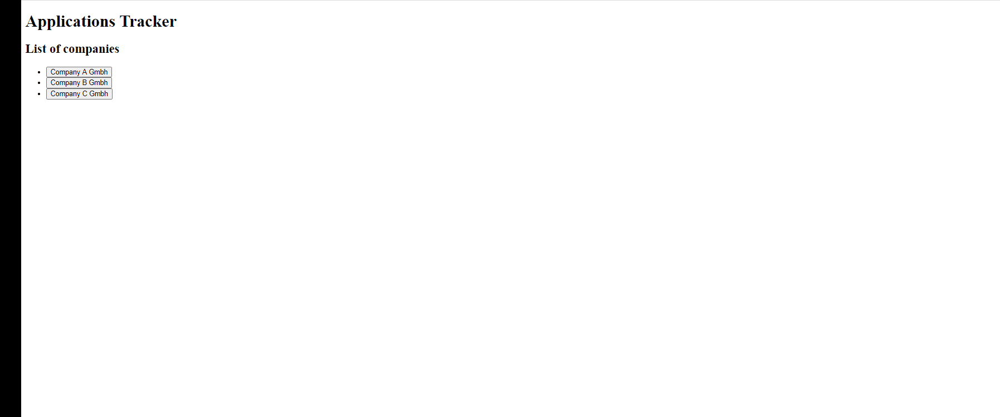

# ember-first-app

This README outlines the details of collaborating on this Ember application.
A short introduction of this app could easily go here.

## Demo

## Running / Development

* `ember serve`
* Visit your app at [http://localhost:4200](http://localhost:4200).
* Visit your tests at [http://localhost:4200/tests](http://localhost:4200/tests).

### Running Tests

* `ember test`
* `ember test --server`

### Linting

* `npm run lint:hbs`
* `npm run lint:js`
* `npm run lint:js -- --fix`

### Building

* `ember build` (development)
* `ember build --environment production` (production)

